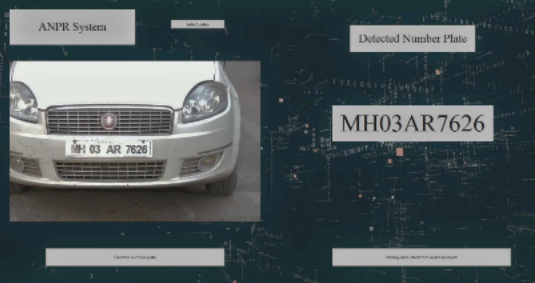

## Automated E-Toll System

### Introduction

With the growth in the number of vehicles, the need for expansive roads catering to thousands of motor vehicles transverse across India has become inevitable. The revenue required for the same is collected mainly through toll booths. However, considering the present situation the modern toll system has some limitations due to the manual collection. This has proved to delay and crowding near the toll systems majorly caused due to the manual money exchange and improper lane management. The implementation of ‘FASTag’ has hardly proved to reduce this traffic and hence it is required to automate the system using the License Plate of the vehicle which is an existing and unique feature of any vehicle.

</img>
 
<b> Curent Scenario at toll centers </b>
 
 

We have proposed a system that majorly consists of License Plate Recognition and the Android Application. It is designed such that the response time of the system is as little as possible. The implementation of e-wallet helps to integrate with Paytm, PayPal and Internet Banking. ​ 

</img> 
 
<b> Proposed System </b>
 
 

</img> 
 
<b> Tkinter ANPR Interface </b>
