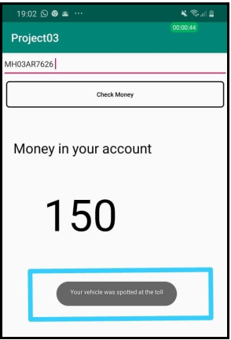

## Automated E-Toll System

### Introduction

Collection of toll has become burdensome for commuters and seldom travelers. The digitizing of wallets has led to people carrying less cash and paying in cash at an unexpected toll becomes tiring. The manual collection of toll even leads to traffic and unnecessary delay at these places. Implementation of RFID based tags ‘FASTag’ have had its drawbacks like non tag vehicles entering the tag reserved lanes and the tag itself not working which makes the situation worse.
With the growing number of drivers and an increase of vehicles on the road come problems associated with traffic. Some of these problems, such as accurate bridge and highway tolling, parking lot management, and speed prevention, can now be solved using machine learning. This project will explore the use of deep learning for the purpose of vehicle tracking and license plate recognition.

</img>  
<b> Curent Scenario at toll centers </b>
 
 

## Propose Solution

Complete removal of toll centre structures has been proposed. Instead of the toll centers, cameras would be put to capture the license plate of vehicles passing by. The license plate would be detected and matched with the vehicle registration details. The user has to install an android application in the device to be able to pay the toll amount from e-wallet. One has to add information of the vehicle i.e. license number and vehicle name. The e-wallet will be linked to the bank account from where one can add money. If the vehicle is registered with the e-toll app, the amount would be automatically deducted from the account. If a vehicle is not registered, notification would be sent to the vehicle owner via mail to pay the toll within a particular amount of time, failing to do so, would be considered a crime.
If a forged or blacklisted license plate is detected by the system, an alert signal will be sent to the concerned authorities. By removing toll centers and promoting payment through application, the delay and disturbance created due to manual collection would be removed.

</img>  
<b> Proposed System </b>
 
 

## Workflow of the proposed solution

The approaching vehicle is detected by the sensor which is placed on the surface over which the vehicle is moving.

</img>  
<b> Detecting Approaching Vehicle </b>
 
 

On sensing the vehicle, the signal is sent to the microcontroller to trigger the camera system to capture/record a video of 2 seconds. The User Interface (UI) of the ANPR system is as shown below.

</img>  
<b> User Interface capturing the video </b>
 
 

</img>  
<b> License Number detected on the User Interface </b>
 
 

As soon as the License Number is detected at the system the required toll amount is deducted from the e-wallet. The notification regarding the vehicle detected at toll is also shown in the android application.

</img>  
<b> Money in E-wallet before Detecting </b>
 
 

</img>  
<b> Money in E-wallet before Detecting </b>
 
 

The user can verify his vehicle on the app by checking the frame which is uploaded on the firebase storage by the ANPR System. Because of Cloud Storage, all this happens in real time and the need of low-latency is achieved.

</img>  
<b> Proof of vehicle detection </b>
 
 

The number plate recognition algorithm was also tested on still images of vehicles. The algorithm works for a fraction of seconds and gives instant output. The test images were taken at different light conditions and different angles. Some extreme angles are not detected by the system which is a limitation of the system. However, it can be rectified by applying some tilt operations for better output.

</img>  
<b> Still Images of License Plates used for testing </b>
 
 

</img>  
<b> Results from still images </b>
 
 