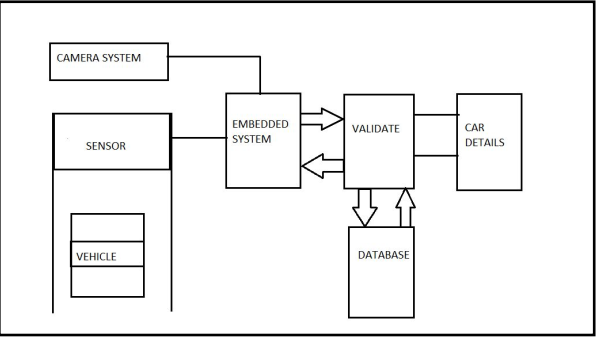

## Automated E-Toll System

### Introduction

Collection of toll has become burdensome for commuters and seldom travelers. The digitizing of wallets has led to people carrying less cash and paying in cash at an unexpected toll becomes tiring. The manual collection of toll even leads to traffic and unnecessary delay at these places. Implementation of RFID based tags ‘FASTag’ have had its drawbacks like non tag vehicles entering the tag reserved lanes and the tag itself not working which makes the situation worse. 

With the growing number of drivers and an increase of vehicles on the road, problems associated with traffic are becoming worse. Some of these problems, such as accurate bridge and highway tolling, parking lot management, and speed prevention, can now be solved using Computer vision algorithms. This project will explore the use of image processing for the purpose of vehicle tracking and license plate recognition.

 </img>  
<b> Curent Scenario at toll centers </b> 

 
 

## Propose Solution

Complete removal of toll centre structures has been proposed. Instead of the toll centers, cameras would be put to capture the license plate of vehicles. The license plate would be detected and matched with the vehicle registration details. 
 

The user has to install an android application in the device to be able to pay the toll amount from e-wallet. One has to add information of the vehicle i.e. license number and vehicle name. The e-wallet will be linked to the bank account from where one can add money. If the vehicle is registered with the e-toll app, the amount would be automatically deducted from the account. If a vehicle is not registered, notification would be sent to the vehicle owner via mail to pay the toll within a particular amount of time.

 </img>  
<b> Proposed System </b> 

 
 

## Workflow of the proposed solution

1. The approaching vehicle is detected by the sensor which is placed on the surface over which the vehicle is moving.

 </img>  
<b> Detecting Approaching Vehicle </b> 

 
 

2. On sensing the vehicle, the signal is sent to the microcontroller to trigger the camera system to capture/record a video of 2 seconds. The User Interface (UI) of the ANPR system is as shown below.

 </img>  
<b> User Interface capturing the video </b> 

 
 

 </img>  
<b> License Number detected on the User Interface </b>
 
 

3. As soon as the License Number is detected at the system the required toll amount is deducted from the e-wallet. The notification regarding the vehicle detected at toll is also shown in the android application.

 </img>  
<b> Money in E-wallet before Detecting </b> 

 
 

 </img>  
<b> Money in E-wallet before Detecting </b> 

 
 

4. The user can verify his vehicle on the app by checking the frame which is uploaded on the firebase storage by the ANPR System. Because of Cloud Storage, all this happens in real time and the need of low-latency is achieved.

 </img>  
<b> Proof of vehicle detection </b> 

 
 

## Testing

The number plate recognition algorithm was also tested on still images of vehicles. The algorithm works for a fraction of seconds and gives instant output. The test images were taken at different light conditions and different angles. Some extreme angles are not detected by the system which is a limitation of the system. However, it can be rectified by applying some tilt operations for better output.

 </img>  
<b> Still Images of License Plates used for testing </b> 

 
 

 </img>  
<b> Results from still images </b> 

 
 

## Conclusion

In this project, the technique to recognize the License Number of vehicles is presented. For this, introduction to image capture, preprocessing, edge detection, segmentation, character resizing and finally recognizing the characters of the number plate specifically on Indian number plates is done. On successful identification of License Number, the toll amount is directly deducted from the e-wallet. The android application hence provides a user friendly interface to verify the toll amount and the vehicle detected. 
  

The database used is Firebase which is integrated with the Number plate detection system and Android application. The string validations helped improve the efficiency of the system by removing erroneous characters. Dataset creation consists of a number of images and videos which are collected at real times.  This system proves to be a user friendly technique for the toll collection system. 

## Future Scope

In future perspective, the speed of license plate recognition can be increased using multithreading. The system, at this level, is processing each frame at a time which leads to more time for the detection. If frames are processed in parallel, then the computing time can be reduced. This system can also be used at parking lots in residential areas, malls and at corporate complexes. The efficiency of the system can be improved more by using a better quality camera for better results. 
 

Neural networks can be used in the license plate extraction for character recognition. This not only improves the efficiency of the system with more and more vehicles, but also helps us to remove the limitation of vernacular font. The network can be trained heavily for different languages and fonts to make our system more independent. The system can also be trained for very low or very bright lighting environments which previously would have been an issue thus
bettering the efficiency of the system 
  

With better real-time vehicle detection algorithms and cameras, the sensors can be removed which is presently needed to notify the camera of an approaching vehicle. With this system, the camera need not be triggered i.e. it will continuously record a video of the road and automatic real-time recognition of vehicles shall be done. This removes our dependency on the sensor.