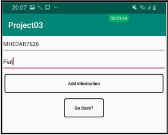

# Android Application for an E-Toll-System

## Methodology for Android Application

From the user’s side, one has to download the android application for the toll system. The user has to then sign-in giving his email id and password followed by adding his vehicle details. 

The steps are for using the application are:

<b>1. Signup and Login - </b>  
The user can register using his email id and a password for his account. The user will be uploading the vehicle details through this account created. This process is carried out using the Firebase Authentication SDK. During login, after passing the details of email id and password, Firebase will verify the credentials and in return, will give a response that tells the application if the authentication is successful or not. The whole process is divided into three activities:
    • Signup Activity: This activity is used to register the user into the application and after successful registration, transfer the user to the Main Activity.
    • Login Activity: This activity is used to login the user into the application and after successful login, transfer the user to Main Activity.
    • Main Activity- This is the stage a user reaches on successful login or sign-up and contains the main features of the application.

 </img>  
<b> Login Page </b> 

 
 

<b>2. Upload Vehicle Information- </b>  
After the login verification, the user first needs to upload the information of his vehicle, i.e. the license plate number and the vehicle name. As a single user can have multiple vehicles, information of several vehicles can be uploaded to the database under a single account. All deductions of toll on detection of the vehicle would be through the same account and would be displayed separately.

 </img>  
<b> Add vehicle information </b> 

 
 

<b>3. Adding Money- </b>  
The user needs to add money to his e-wallet. No constraints have been added regarding the amount of money that can be added to the e-wallet as of now. 

 </img>  
<b> Add vehicle information </b> 

 
 

<b>4. Deducting Money - </b>  
Whenever a vehicle linked with the user’s account has been spotted at any toll, a notification will be sent to the user and money will be directly deducted from his e-wallet. If there is no sufficient money in the e-wallet, he will get a warning regarding the same.

 </img>  
<b> E-Wallet Balance </b> 

 
 

<b>5. Verification of Detected Vehicle - </b>  
The user can verify his vehicle on the app by checking the frame which is uploaded on the firebase storage by the ANPR System. Because of Cloud Storage, all this happens in real time and the need of low-latency is achieved. 

 </img>  
<b> Verification </b> 

 
 

Thus, on successful verification the payment is done as the vehicle passes the toll center. The time required for the vehicle detection and payment of toll is very less as compared to the manual collection. This helps reduce the traffic at the toll center and the vehicles are moving at a faster rate.