# ANPR System for an E-Toll-App

## Dev setup

### For Ubuntu - 

1. Clone repo
2. Create python venv `python3 -m venv venv`
3. Install all pip dependencies `pip install -r requirements.dev.txt`
4. Make a copy of the .env.sample and rename to .env
5. Install tesseract using `sudo apt-get install tesseract-ocr`
6. Install tkinter using `sudo apt-get install python3-tk`
7. Add Firebase Details in .env file

## Running the ANPR System

1. Activate the created environment using `source ./venv/bin/activate`
2. Run `python tk_interface.py`
3. Click on "Select Video" button and select the video for which the number plate needs to be detected. 
4. Click on "Find Number Plate" button and the ANPR system will detect the Number Plate from the frames of the video and display on the interface.

## Testing

1. You can use the [Sample Jupyter Notebook](https://github.com/yashmarathe21/e-toll-app/blob/master/anpr_system/test.ipynb) to test with your sample data.
2. You can use the command `python test_image.py --img_path "./sample_data/images/MH03AF5034.JPG"` to find Number Plate in the given img_path.
3. You can use the command `python test_video.py --video_path "./sample_data/videos/sample_video.mp4"` to find Number Plate in the given video_path.

## ANPR Algorithm

1. FRAME GENERATION:
The video generated by the camera is sent to be executed by a program that converts video into frames. Each frame is sent to the pre-processing unit after which it is run for license plate detection and extraction. Each frame generated is saved as ‘framei’ with i being the ith frame generated from the video.

 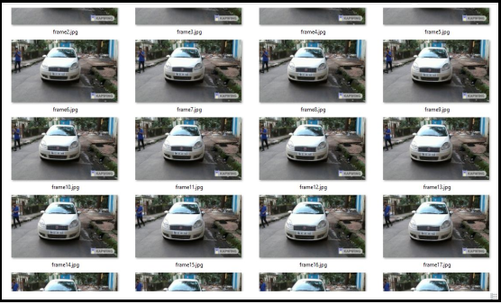</img>  
<b> Generation of Frames </b> 

 
 

 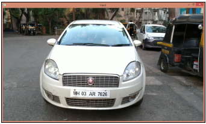</img>  
<b> Generated Frame </b> 

 
 

2. PRE- PROCESSING:
The generated frame is first pre-processed with the following steps to attain a Thresholded image for contour analysis. The steps for pre-processing are shown in the figure below.

 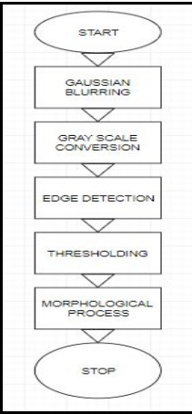</img>  
<b> Flowchart of preprocessing steps </b> 

 
 

The first step involved is -  
a. GAUSSIAN BLURRING: Blurring is implemented using Gaussian filters to smoothen out the image obtained. This is done to remove the salt and pepper noises present which can affect the detection algorithm. The blurring step removes any unnecessary contours that may be needed to be analyzed if passed onto the next step. Specifically, a Gaussian kernel (used for Gaussian blur) is a square array of pixels where the pixel values correspond to the values of a Gaussian curve (in 2D).Each pixel in the image gets multiplied by the Gaussian kernel. This is done by placing the centre pixel of the kernel on the image pixel and multiplying the values in the original image with the pixels in the kernel that overlap. The values resulting from these multiplications are added up and that result is used for the value at the destination pixel.

 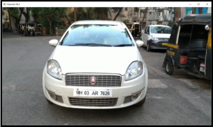</img>  
<b> Gaussian Blurring on the generated frame </b> 

 
 

b. GRAY SCALE CONVERSION- The edge detected image is converted to gray scale.

 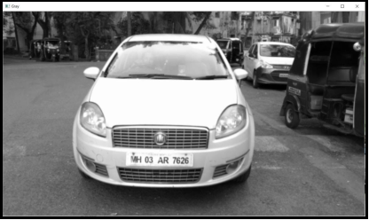</img>  
<b> Grayscale converted image of the frame </b> 

 
 

c. EDGE DETECTION- As the boundary of the license plate is a clearly defined boundary, edge detection can be used to obtain the same. Sobel mask using horizontal basis is used in the program. Edge detection works on the principles of high pass filters. The sharp transition in intensity of pixels on and around a boundary makes it to have high frequency properties which are passed by the edge detector whereas stopping the continuous intensity pixels.

 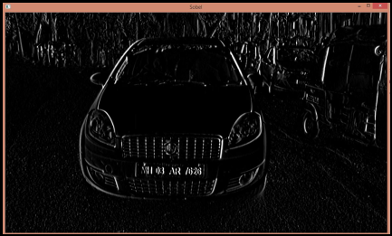</img>  
<b> Sobel edge detected output of the frame </b> 

 
 

d. THRESHOLDING- The image is Thresholded into binary format using Otsu’s method of thresholding. Otsu's thresholding method involves iterating through all the possible threshold values and calculating a measure of spread for the pixel levels each side of the threshold, i.e. the pixels that either falls in foreground or background. The aim is to find the threshold value where the sum of foreground and background spreads is at its minimum. This is done by analyzing histograms for the background and foreground spread of the contending threshold values.

 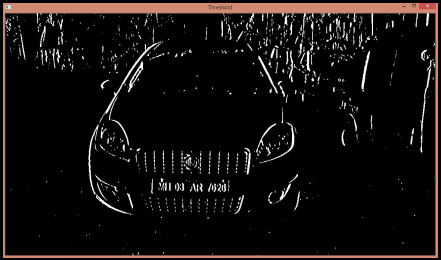</img>  
<b> Thresholded Image of the frame </b> 

 
 

e. MORPHOLOGICAL PROCESS- Dilation is applied on the threshold image with a structuring element of size 17x3. Dilation process widens the thickness of the boundary detected, i.e. Morphological dilation makes objects more visible and fills in small holes in objects. This makes it easier for us to handle the edges detected in the image which contains the license plate boundary.

 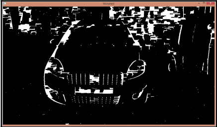</img>  
<b> Dilated output of the frame </b> 

 
 

3. CONTOUR ANALYSIS:
The contours are extracted in a matrix and analyzed one by one. Several steps are conducted to eliminate the non- probable license plates.
    1. Checking angle parameter - The contours satisfying the angle parameters of the rectangle are considered.
    2. Checking aspect ratio- The aspect ratio is found to be 4.727 which is the ratio of width to height to be the threshold for license plate. The min and max parameters are defined using this. The area of the contour is compared and determined if they satisfy the condition. The contours unsatisfying criteria are removed from the contour matrix.
    3. Average Value of Contour- The average value of the pixels in the defined contour is found out. If it exceeds the value of 115, the contour is considered for the next step else, discarded.
    4. The contours are analyzed again and the most probable one is selected.

4. DETECTION OF LICENSE PLATE:
The selected contour region is cropped and considered as the license plate for further analysis. The coordinates of the selected contour region is noted and a rectangle is drawn on the generated frame.

 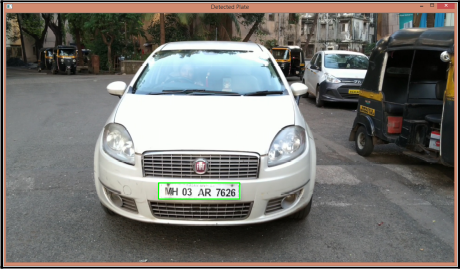</img>  
<b> Final Contour Detected </b> 

 
 

5. EXTRACTION OF LICENSE PLATE:
The license plate obtained after cropping is sent to the Tesseract OCR module for character recognition.

 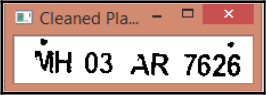</img>  
<b> Cleaned Plate </b> 

 
 

The Tesseract package contains an OCR engine - libtesseract and a command line program - Tesseract. Tesseract has Unicode (UTF-8) support, and can recognize more than 100 languages. It can be trained to recognize other languages. Tesseract supports various output formats: plain-text, html. Tesseract up to and including version 2 could only accept TIFF images of simple one column text as inputs. These early versions did not include layout analysis and so inputting multi-columned text, images, or equations produced a garbled output. Since version 3.00 Tesseract has supported output text formatting, OCR positional information and page layout analysis. Tesseract can detect whether text is monospaced or proportional. Tesseract can be trained to work in other languages too. Tesseract is suitable for use as a backend, and can be used for more complicated OCR tasks including layout analysis by using a frontend such as OCRopus. In this project, Tesseract is used as the final step for OCR after the image has been sufficiently processed so as to get optimum output.

6. VALIDITY OF LICENSE PLATE EXTRACTED:

Primarily, the length of the license plate number string obtained is checked against standards. The validity of the license plate is determined by comparing the first two characters extracted with all the RTO codes in India. To improve efficiency, changes in the recognized number are made in places where the detected character at a position is obviously wrong and accordingly rectified keeping the Indian License Plate as standard. 

The changes are:
    1. ‘O’ detected at positions of a number is changed to zero and vice versa.
    2. ‘S’ detected at positions of a number is changed to 5 and vice versa.

The validity of the license plate is determined by comparing the first two characters extracted with all the RTO codes in India. The no. of characters extracted and their respective character and number positions are also compared with the ideal license plate. If all the conditions are satisfied, the loop is terminated and the detected plate is displayed.

 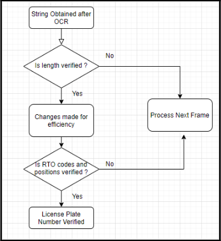</img>  
<b> Validation flowchart </b> 

 
 

## Database Operations

Transfer of Extracted License Number to Database

In the 3rd step, the extracted and verified license plate number is uploaded onto a Real time Database (Firebase). The number is checked against the existing users registered and using the E- wallet Application. On finding a match, automatic deduction of toll is done through the application. If the existing user has insufficient funds, he/she is notified about the same in the application. If the license plate registered does not have a pre-existing account, an official notification concerning the payment of toll due is sent to the registered phone or email-id of the vehicle owner. For the purpose of providing a proof to the customer, the system uploads the frame at which the correct number plate was detected on the firebase storage which is accessible to the customer on his android application. 

The ANPR System is linked with a Firebase Real time Database. It is a Backend-as-a-Service — BaaS — that started as an YC11 Startup and grew up into a next-generation app-development platform on Google Cloud Platform. Firebase frees developers to focus crafting better user experiences. There is no need to manage servers and to write APIs. Firebase is the server, API and the data store, all written so generically that it can be modified to suit most needs.  

The reason why Firebase Database has been chosen is because it is supported by various languages and platforms. It can be used for building a back-end for various platforms like android, iOS, Web, etc. Firebase is a Cloud hosted database, i.e. it runs on a cloud and access to the user is provided as a service. It stores data in JSON (JavaScript Object Notation) format, a format to store or transport data. Due to the data synchronization used in real time, every update is received by the devices/clients in no time. As the database can be accessed directly from the mobile device or any system, there is no need for an application server.

 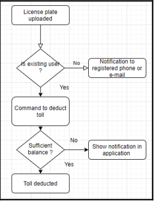</img>  
<b> Toll Deduction Process </b> 

 
 

